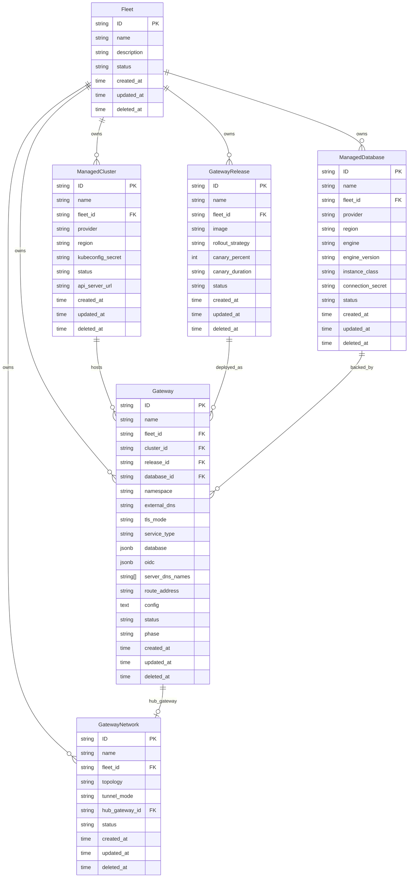

# Data Model

**Date:** 2026-08-03
**Status:** Active

## Overview

The HyperShell API server provides a control plane for deploying and managing distributed API gateways across multiple Kubernetes clusters and cloud providers. The model is organized around fleets:

- **Fleet** — top-level organizational unit. Groups clusters, databases, releases, gateways, and networks. All resources belong to exactly one fleet via `fleet_id`.
- **ManagedCluster** — a Kubernetes cluster registered into a fleet. Tracks provider, region, API server URL, and a kubeconfig secret reference.
- **ManagedDatabase** — a database instance provisioned for a fleet. Tracks provider, region, engine type/version, instance class, and a connection secret reference.
- **GatewayRelease** — a versioned container image for gateway deployments within a fleet. Supports rollout strategies with canary percent/duration controls.
- **Gateway** — an API gateway instance deployed onto a specific cluster, using a specific release and database, within a namespace. Tracks TLS mode, service type, external DNS, lifecycle phase, OIDC authentication configuration, server DNS names for TLS certificates, and optional inline database provisioning config. The control plane reconciles Gateway resources into Kubernetes workloads (see [gateway deployment spec](openshell-gateway-deployment.spec.md)).
- **GatewayNetwork** — defines network connectivity topology between gateways in a fleet. Supports tunnel modes and designates a hub gateway for hub-and-spoke or mesh networking.

## Entity Relationship Diagram

## Requirements

### Requirement: Fleet Lifecycle

The system SHALL support creating, reading, updating, and deleting Fleets. A Fleet SHALL have a unique name, optional description, and a status field.

#### Scenario: Create Fleet
- GIVEN a valid fleet name
- WHEN a POST request is made to `/api/hypershell/v1/fleets`
- THEN a new Fleet is created with a KSUID
- AND the response includes the created Fleet

### Requirement: Fleet-Scoped Resources

All resources (ManagedCluster, ManagedDatabase, GatewayRelease, Gateway, GatewayNetwork) SHALL belong to exactly one Fleet via `fleet_id`.

#### Scenario: Create Gateway with Fleet Reference
- GIVEN a valid fleet_id, cluster_id, release_id, and database_id
- WHEN a POST request is made to `/api/hypershell/v1/gateways`
- THEN a new Gateway is created within the specified fleet
- AND the Gateway references valid cluster, release, and database resources

### Requirement: Gateway Deployment Lifecycle

A Gateway SHALL track its deployment lifecycle through the `phase` field. The `status` field SHALL reflect operational health.

#### Scenario: Gateway Phase Progression
- GIVEN a Gateway in phase "Pending"
- WHEN the control plane provisions it on the target cluster
- THEN the phase SHALL transition to "Provisioning"
- AND upon successful deployment, to "Running"

### Requirement: Gateway Database Strategy

A Gateway SHALL support two mutually exclusive database strategies: referencing an external ManagedDatabase via `database_id`, or provisioning an in-cluster PostgreSQL instance via the inline `database` JSONB field. Setting both is a validation error. The inline `database` field accepts `image` (PostgreSQL container image) and `storage_size` (PVC size, default `5Gi`). See [database provisioning spec](openshell-gateway-database.spec.md).

#### Scenario: Inline Database
- GIVEN a Gateway with `database: {image: "registry.access.redhat.com/hi/postgresql:18"}` and `database_id` null
- WHEN the control plane processes the Gateway
- THEN it SHALL provision an in-cluster PostgreSQL instance in the Gateway's namespace

#### Scenario: External Database
- GIVEN a Gateway with `database_id` referencing a ManagedDatabase and no inline `database`
- WHEN the control plane processes the Gateway
- THEN it SHALL use the ManagedDatabase's connection endpoint

### Requirement: Gateway OIDC Configuration

A Gateway SHALL support optional OIDC authentication via the `oidc` JSONB field. When `oidc.issuer` is set, the control plane injects OIDC settings into the gateway's configuration and disables unauthenticated access. See [OIDC spec](openshell-gateway-oidc.spec.md).

#### Scenario: OIDC Enabled
- GIVEN a Gateway with `oidc: {issuer: "https://keycloak.example.com/realms/hypershell", audience: "hypershell-frontend"}`
- WHEN the control plane generates the gateway configuration
- THEN the OIDC section SHALL be injected into `gateway.toml`
- AND `allow_unauthenticated_users` SHALL be `false`

### Requirement: Gateway Server DNS Names

A Gateway SHALL declare TLS certificate DNS SANs via the `server_dns_names` field. The control plane uses these names when issuing certificates via cert-manager or the certgen Job. See [TLS spec](openshell-gateway-tls.spec.md).

### Requirement: Gateway Route Address

The `route_address` field SHALL be set by the control plane (not the user) after creating GRPCRoute resources. It contains the gateway's external gRPC endpoint (e.g. `grpcs://openshell-gateway.gw.localhost:443`). See [routing spec](openshell-gateway-routing.spec.md).

### Requirement: Canary Release Strategy

A GatewayRelease SHALL support canary deployment via `rollout_strategy`, `canary_percent`, and `canary_duration` fields.

#### Scenario: Canary Rollout
- GIVEN a GatewayRelease with `rollout_strategy: canary`, `canary_percent: 10`, `canary_duration: 30m`
- WHEN the release is deployed
- THEN 10% of traffic SHALL route to the new version
- AND after 30 minutes, the rollout SHALL proceed to full deployment

### Requirement: Network Topology

A GatewayNetwork SHALL define how gateways within a fleet communicate. The `topology` field indicates the network shape and `tunnel_mode` the encapsulation method.

#### Scenario: Hub-and-Spoke Network
- GIVEN a GatewayNetwork with `topology: hub-spoke` and a `hub_gateway_id`
- WHEN gateways join the network
- THEN all spoke gateways SHALL route through the hub gateway

## API Reference

All routes under `/api/hypershell/v1/`:

| Method | Path | Operation |
|--------|------|-----------|
| GET/POST | `/fleets` | List/Create |
| GET/PATCH/DELETE | `/fleets/{id}` | Get/Update/Delete |
| GET/POST | `/gateways` | List/Create |
| GET/PATCH/DELETE | `/gateways/{id}` | Get/Update/Delete |
| GET/POST | `/gateway_networks` | List/Create |
| GET/PATCH/DELETE | `/gateway_networks/{id}` | Get/Update/Delete |
| GET/POST | `/gateway_releases` | List/Create |
| GET/PATCH/DELETE | `/gateway_releases/{id}` | Get/Update/Delete |
| GET/POST | `/managed_clusters` | List/Create |
| GET/PATCH/DELETE | `/managed_clusters/{id}` | Get/Update/Delete |
| GET/POST | `/managed_databases` | List/Create |
| GET/PATCH/DELETE | `/managed_databases/{id}` | Get/Update/Delete |

## Design Decisions

| Decision | Rationale |
|----------|-----------|
| KSUID for all IDs | Sortable, globally unique, no coordination required |
| Fleet as top-level scope | Natural tenant boundary for multi-team environments |
| Separate Release from Gateway | Decouples versioning from deployment; enables canary and rollback |
| GatewayNetwork as explicit entity | Makes network topology declarative and auditable |
| Secret references (not inline secrets) | Keeps secrets in K8s Secrets, not in the database |
